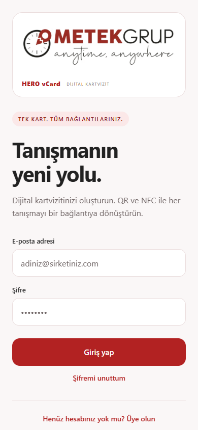

# METEK HERO vCard

METEK GRUP için geliştirilen dijital kartvizit uygulaması. Hesap oluşturma, kartvizit yönetimi, markalı QR paylaşımı, vCard (.vcf) indirme ve NFC kart yazma akışlarını içerir.



## Proje yapısı

| Klasör | İçerik |
| --- | --- |
| [metek-hero-vcard](metek-hero-vcard) | Expo / React Native mobil uygulama, web önizlemesi ve Node.js / SQLite yönetim API'si |
| [metek-public](metek-public) | İnternetten erişilen kartvizit sayfası, VCF indirme ve Cloudflare D1 kart servisi |

## Yerelde çalıştırma

Node.js 24 veya üzeri gerekir. Önce uygulama klasörüne geçin ve paketleri kurun:

```powershell
cd metek-hero-vcard
npm.cmd ci
Copy-Item .env.example .env
```

Bir terminalde yönetim API'sini başlatın:

```powershell
npm.cmd run api
```

Aynı klasörde ikinci terminalde web önizlemesini açın:

```powershell
npm.cmd run web
```

Tarayıcıda http://localhost:8081 adresini açıp yeni bir uygulama hesabı oluşturun. Depo, mevcut kullanıcı veritabanını veya kullanıcı hesaplarını içermez.

## Expo Go

Bilgisayardaki Expo CLI ve telefondaki Expo Go aynı Expo hesabıyla açık olmalıdır. Telefon ile bilgisayar aynı ağdayken:

```powershell
npx.cmd expo login --browser
npm.cmd run go:lan
```

Mobil internetten denemek için `npm.cmd run go:cloudflare` seçeneği de vardır; bunun için Cloudflare'ın `cloudflared` aracı gerekir. Ayrıntılar [uygulama kurulum belgesinde](metek-hero-vcard/README.md) yer alır. Bu geliştirme bağlantıları geçicidir ve bilgisayarın açık kalmasını gerektirir. NFC yazma, Expo Go yerine NFC modülü içeren bir Development Build gerektirir.

## Paylaşım servisi

GitHub deposu kaynak kodunu paylaşır; uygulamayı veya API'yi kendiliğinden yayına almaz. QR ile internetten kartvizit açılması için HTTPS kart servisinin ayrıca kurulması ve `.env` bağlantı ayarlarının yapılması gerekir. Sunucu anahtarları bu depoya dahil değildir.

- [Kart servisinin kurulumu ve yapısı](metek-public/METEK.md)
- [Uygulama mimarisi](metek-hero-vcard/MIMARI.md)
- [Doğrulama kayıtları ve tamamlanmamış işler](metek-hero-vcard/TESTLER.md)

## Kontroller

Uygulama klasöründe:

```powershell
npm.cmd run typecheck
npm.cmd test
```

Bu sürüm geliştirme aşamasındadır. E-posta doğrulama, şifre sıfırlama ve yönetici ekranları henüz tamamlanmamıştır; cihaz paylaşımı ve NFC için fiziksel cihaz testleri gerekir.
